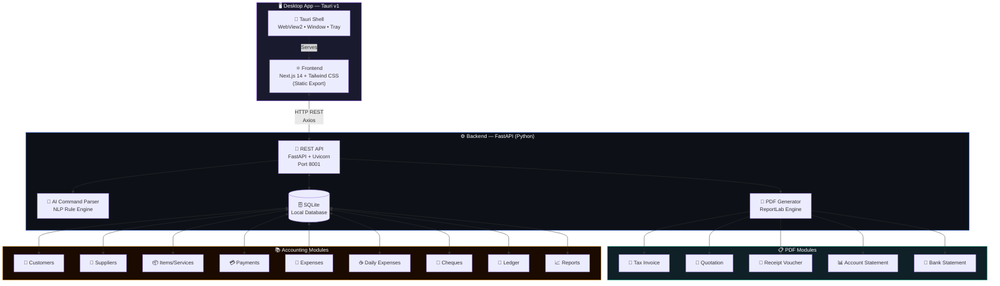

<div align="center">

# FinPilot AI
### Professional Desktop Accounting Software for UAE Businesses

[](https://github.com/zohair-azmat-ai/FinPilot-AI-Desktop-Accounting-Software)
[](https://tauri.app)
[](https://fastapi.tiangolo.com)
[](https://nextjs.org)
[](https://sqlite.org)
[](https://python.org)
[](LICENSE)
[](https://github.com/zohair-azmat-ai)
[]()

---

*A Tally-level accounting system built for UAE SMEs — fully offline, desktop-native, with professional PDF generation, VAT compliance, and AI command support.*

</div>

---

## Project Overview

**FinPilot AI** is a complete, offline-first desktop accounting solution designed specifically for UAE small and medium businesses. It replaces expensive cloud SaaS tools with a fast, locally-installed app that runs entirely on your machine — no subscription, no internet required, no data sent to servers.

Built with a modern tech stack (Tauri + Next.js + FastAPI + SQLite), it generates professional-grade PDFs — invoices, quotations, receipt vouchers, and statements — with letterhead, company stamp, and UAE VAT compliance baked in.

---

## Key Features

| Module | Features |
|--------|----------|
| **Invoices** | Auto-numbered, VAT 5%, discount, letterhead/stamp, PDF export |
| **Quotations** | Convert to invoice, valid-until date, mandatory stamp, UAE workshop style |
| **Payments** | Receipt vouchers, amount-in-words, partial payments, cheque tracking |
| **Daily Expenses** | 8 categories (tea, petrol, parking, labour, courier, supplies…) |
| **General Expenses** | Supplier-linked, bank-linked, full CRUD |
| **Bank Accounts** | Multi-account, transactions, statement PDF |
| **Cheques** | Inward/outward cheques, status tracking |
| **Customers** | Full CRM, TRN, opening balance, ledger |
| **Suppliers** | Supplier management, purchase tracking |
| **Items / Services** | Price catalog, VAT toggle, unit types |
| **Ledger** | Auto-generated debit/credit running balance |
| **Reports** | Sales, Outstanding, VAT (UAE FTA), Customer Balance |
| **AI Commands** | Natural language → accounting actions (no API key needed) |
| **PDF Engine** | ReportLab, letterhead, company stamp, amount-in-words |
| **Offline First** | SQLite, 100% local, zero cloud dependency |

---

## Screenshots

> Replace with actual screenshots in [`docs/screenshots/`](docs/screenshots/)

| Dashboard | Invoice |
|-----------|---------|
|  |  |

| Quotation | Reports |
|-----------|---------|
|  |  |

---

## Architecture



---

## Tech Stack

| Layer | Technology | Purpose |
|-------|-----------|---------|
| **Desktop Shell** | Tauri v1 (Rust) | Native window, WebView2, system tray |
| **Frontend** | Next.js 14 + Tailwind CSS | UI, routing, dark theme |
| **Backend** | FastAPI + Uvicorn (Python) | REST API, business logic |
| **Database** | SQLite + SQLAlchemy | Local offline storage |
| **PDF Engine** | ReportLab | Invoice, quotation, voucher generation |
| **AI Parser** | Custom NLP rules | Natural language → accounting actions |
| **Build** | PyInstaller | Bundle backend into portable .exe |

---

## PDF Modules

All PDFs are generated locally using [ReportLab](https://www.reportlab.com/) and saved to `%USERPROFILE%\FinPilot\exports\`.

### Tax Invoice
- Auto-numbered (INV-0001, INV-0002…)
- VAT 5% per line item
- 8-column items table (SR, Description, Qty, Price, Amount, Tax Rate, Tax Amt, Total)
- Bank details footer
- Digital letterhead support
- Company stamp (optional)
- Amount in words

### Quotation (UAE Workshop Style)
- Professional bordered layout
- Customer details + Quotation details boxes
- Mandatory company stamp + Authorized Signature
- Amount in words row (e.g. `ONE THOUSAND FIFTY ONLY ***`)
- Soft T&C: Delivery as agreed / Prices valid for limited period
- Single-page guarantee with dynamic filler rows

### Receipt Voucher
- Advance / Standard receipt modes
- Payment allocation table
- Stamp + signature

### Account Statement
- Date-range filtered
- Running balance per transaction
- Opening / closing balance

### Bank Statement
- Per-account transaction history
- Balance summary

---

## Accounting Features

```
✅ UAE VAT 5% — FTA compliant invoicing
✅ Multi-customer ledger
✅ Partial payment tracking
✅ Cheque inward/outward register
✅ Bank account multi-ledger
✅ Daily petty cash tracking
✅ Supplier expense management
✅ Auto-invoice numbering
✅ Quotation → Invoice one-click convert
✅ Outstanding AR report
✅ VAT return summary report
✅ 100% offline — no cloud, no subscription
```

---

## Installation

### Prerequisites

| Tool | Version | Download |
|------|---------|----------|
| Python | 3.10+ | [python.org](https://python.org) |
| Node.js | 18+ | [nodejs.org](https://nodejs.org) |

### Quick Start (Windows)

```bat
:: 1. Clone the repo
git clone https://github.com/zohair-azmat-ai/FinPilot-AI-Desktop-Accounting-Software.git
cd FinPilot-AI-Desktop-Accounting-Software

:: 2. First-time setup (installs dependencies)
setup.bat

:: 3. Launch the app
start.bat
```

App opens at **http://localhost:3000**

---

## Development Setup

### Backend (FastAPI)

```bash
cd backend
pip install -r requirements.txt
uvicorn main:app --host 127.0.0.1 --port 8001 --reload
```

API docs: http://127.0.0.1:8001/docs

### Frontend (Next.js)

```bash
cd frontend
npm install
npm run dev
```

UI: http://localhost:3000

### Environment

The frontend connects to `http://127.0.0.1:8001` by default. Override in `frontend/.env.local`:

```env
NEXT_PUBLIC_API_URL=http://127.0.0.1:8001
```

---

## Build Desktop App

### Build Backend (.exe)

```bash
cd backend
pip install pyinstaller
pyinstaller backend.spec --noconfirm
# Output: backend/dist/backend/backend.exe
```

### Build Frontend (Static)

```bash
cd frontend
npm run build
# Output: frontend/out/
```

### Package with Tauri

```bash
# Requires Rust: https://rustup.rs
cd src-tauri
cargo tauri build
# Output: src-tauri/target/release/bundle/
```

---

## Data Storage

All data stored locally — zero cloud:

```
%USERPROFILE%\FinPilot\
  ├── finpilot.db          # SQLite database
  ├── assets\
  │   ├── letterhead.jpg   # Company letterhead image
  │   └── stamp.png        # Company stamp image
  ├── exports\             # Generated PDFs
  └── backups\             # Database backups
```

---

## AI Command Box

Natural language commands — no API key, no internet:

```
"Create invoice for Gulf Extrusion 1000 AED"
"Show ledger for Ahmed LLC"
"Make statement for May"
"Add payment 500 AED to invoice INV-0001"
"Show VAT report"
"Backup database"
```

---

## Roadmap

- [ ] Multi-company support
- [ ] Email PDF directly from app
- [ ] Purchase order module
- [ ] Inventory management
- [ ] WhatsApp integration (send invoice)
- [ ] Mobile companion app (view-only)
- [ ] Arabic language support
- [ ] Cloud backup (optional)

---

## Author

**Zohair Azmat**

[](https://github.com/zohair-azmat-ai)

Built with dedication for UAE small business owners who deserve professional accounting tools without the enterprise price tag.

---

## License

```
MIT License — Copyright (c) 2026 Zohair Azmat

Free to use, modify, and distribute.
```

See [LICENSE](LICENSE) for full terms.

---

<div align="center">

*Made with ❤️ for UAE SMEs*

**FinPilot AI** — Because every business deserves professional accounting.

</div>
