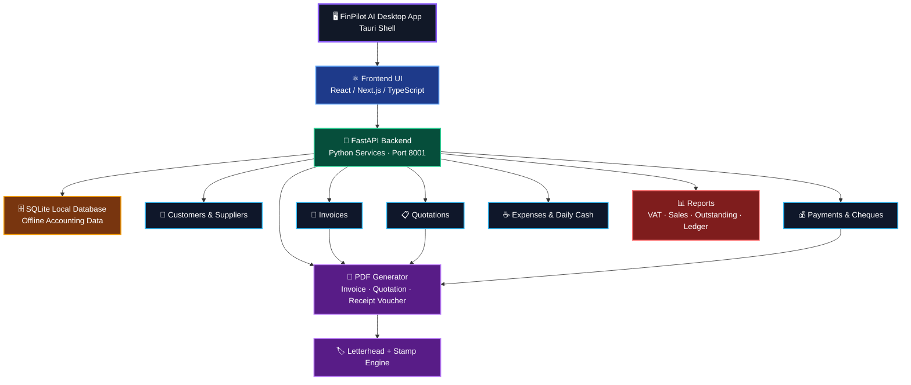

<div align="center">

<p align="center">
  
</p>

# FinPilot AI — Desktop Accounting Software

### Professional offline-first accounting, invoicing, quotation, receipt voucher, expense, and reporting system for UAE workshop operations.

---

[](https://github.com/zohair-azmat-ai)
[](https://github.com/zohair-azmat-ai/FinPilot-AI-Desktop-Accounting-Software)
[]()

[](https://tauri.app)
[](https://fastapi.tiangolo.com)
[](https://sqlite.org)

[]()
[](https://github.com/zohair-azmat-ai)
[]()

</div>

---

## Project Overview

**FinPilot AI** is a complete, offline-first desktop accounting solution built for UAE small and medium businesses — specifically for workshops, trading companies, and service operations.

It replaces expensive cloud SaaS subscriptions with a fast, locally-installed desktop application that runs entirely on your machine. No monthly fees. No internet required. No data leaves your system.

Built on a modern stack — **Tauri + Next.js + FastAPI + SQLite** — it generates professional-grade PDFs (invoices, quotations, receipt vouchers, account statements) with company letterhead, stamp, and full UAE VAT 5% compliance.

---

## Architecture



---

## Key Features

| Module | Capabilities |
|--------|-------------|
| **🧾 Tax Invoices** | Auto-numbered, VAT 5% per line, 8-column table, letterhead, stamp, bank details, amount-in-words |
| **📋 Quotations** | UAE workshop style, mandatory stamp, convert → invoice, valid-until, dynamic filler rows |
| **💳 Payments** | Receipt vouchers, advance payments, partial allocations, amount-in-words |
| **📜 Cheques** | Inward/outward register, status tracking (pending → cleared → bounced) |
| **🏦 Bank Accounts** | Multi-account management, transaction ledger, bank statement PDF |
| **☕ Daily Expenses** | 8 categories: tea, petrol, parking, labour lunch, courier, supplies, tools, other |
| **💸 General Expenses** | Supplier-linked, bank-linked, full CRUD, date-range reporting |
| **👥 Customers** | Full CRM, TRN, opening balance, ATTN, auto-ledger |
| **🚚 Suppliers** | Supplier management with expense linkage |
| **📦 Items / Services** | Price catalog, VAT toggle, unit types (Nos, Kg, m², Service…) |
| **📖 Ledger** | Auto-generated debit/credit with running balance |
| **📊 Reports** | Sales, Outstanding AR, VAT (UAE FTA), Customer Balance |
| **🤖 AI Commands** | Natural language → accounting actions (no API key needed) |

---

## PDF Engine

All PDFs generated locally via [ReportLab](https://www.reportlab.com/) and saved to `%USERPROFILE%\FinPilot\exports\`.

### Tax Invoice
- Auto-numbered (INV-0001, INV-0002…)
- 8-column items table with VAT per line
- Bank details footer with IBAN
- Amount in words (e.g. *One Thousand Fifty Only*)
- Digital letterhead drawn on canvas
- Company stamp (optional)

### Quotation (UAE Workshop Style)
- Bordered customer details + quotation info boxes
- Items table with dynamic filler rows (fills page professionally)
- Amount in words row: `TOTAL :-   ONE THOUSAND FIFTY ONLY   *****`
- Mandatory company stamp + Authorized Signature
- Soft T&C: Delivery as agreed / Prices valid for limited period / Material once approved cannot be returned
- Single-page guarantee

### Receipt Voucher
- Standard and Advance modes
- Payment allocation breakdown
- Company stamp, signature area

### Account Statement
- Date-range filtered, running balance
- Opening and closing balance

---

## Screenshots

> Add screenshots to [`docs/screenshots/`](docs/screenshots/) and they will appear here.

| Dashboard | Invoice |
|-----------|---------|
|  |  |

| Quotation | Reports |
|-----------|---------|
|  |  |

---

## Tech Stack

| Layer | Technology | Role |
|-------|-----------|------|
| **Desktop Shell** | Tauri v1 (Rust) | Native window, WebView2, bundling |
| **Frontend** | Next.js 14 + Tailwind CSS | Dark-theme UI, routing, API calls |
| **Backend** | FastAPI + Uvicorn (Python) | REST API, business logic, PDF generation |
| **Database** | SQLite + SQLAlchemy ORM | Local offline data persistence |
| **PDF Engine** | ReportLab | Invoice, quotation, voucher, statement PDFs |
| **AI Parser** | Custom NLP rule engine | Natural language → accounting actions |
| **Packaging** | PyInstaller + Tauri | Bundle into portable desktop `.exe` |

---

## Project Structure

```
FinPilot AI/
├── backend/                     # FastAPI Python backend
│   ├── main.py                  # App entry + database migrations
│   ├── database.py              # SQLite connection (SQLAlchemy)
│   ├── models.py                # ORM models (all tables)
│   ├── schemas.py               # Pydantic request/response schemas
│   ├── pdf_generator.py         # ReportLab PDF engine (all document types)
│   ├── ai_parser.py             # NLP command parser
│   ├── routes/                  # API route handlers
│   │   ├── invoices.py          # Invoice CRUD + PDF
│   │   ├── quotations.py        # Quotation CRUD + convert + PDF
│   │   ├── payments.py          # Payment recording + receipt voucher
│   │   ├── expenses.py          # General + daily expenses
│   │   ├── bank_accounts.py     # Bank account management
│   │   ├── bank_transactions.py # Transaction ledger + statement
│   │   ├── cheques.py           # Cheque register
│   │   ├── customers.py         # Customer CRM
│   │   ├── suppliers.py         # Supplier management
│   │   ├── ledger.py            # Ledger + account statements
│   │   ├── reports.py           # Sales / VAT / outstanding reports
│   │   └── ai_command.py        # AI command processing
│   └── requirements.txt
│
├── frontend/                    # Next.js 14 + Tailwind CSS
│   └── src/
│       ├── app/                 # App Router pages
│       │   ├── page.tsx         # Dashboard
│       │   ├── invoices/        # Invoice list + new invoice
│       │   ├── quotations/      # Quotation builder
│       │   ├── payments/        # Payment recording
│       │   ├── expenses/daily/  # Daily expense tracker
│       │   ├── bank/            # Bank accounts, transactions, cheques
│       │   ├── ledger/          # Customer ledger
│       │   ├── reports/         # Reports dashboard
│       │   └── ai/              # AI command interface
│       ├── components/
│       │   ├── Sidebar.tsx      # Navigation sidebar
│       │   └── Header.tsx       # Page header
│       └── lib/api.ts           # Axios API client
│
├── desktop/                     # Tauri desktop wrapper
│   └── src-tauri/
│       ├── src/main.rs          # Tauri entry point
│       ├── Cargo.toml           # Rust dependencies
│       └── tauri.conf.json      # Window + bundle config
│
├── docs/
│   ├── assets/                  # Logo and branding files
│   └── screenshots/             # App screenshots
│
├── setup.bat                    # First-time dependency installer
├── start.bat                    # Launch backend + frontend
└── README.md
```

---

## Installation

### Prerequisites

| Tool | Version |
|------|---------|
| Python | 3.10+ |
| Node.js | 18+ |

### Quick Start (Windows)

```bat
git clone https://github.com/zohair-azmat-ai/FinPilot-AI-Desktop-Accounting-Software.git
cd FinPilot-AI-Desktop-Accounting-Software
setup.bat
start.bat
```

App opens at **http://localhost:3000**

---

## Development Setup

### Backend

```bash
cd backend
pip install -r requirements.txt
uvicorn main:app --host 127.0.0.1 --port 8001 --reload
```

Swagger docs: http://127.0.0.1:8001/docs

### Frontend

```bash
cd frontend
npm install
npm run dev
```

UI: http://localhost:3000

---

## Build Desktop App

### 1. Bundle Backend

```bash
cd backend
pyinstaller backend.spec --noconfirm
# Output → backend/dist/backend/backend.exe
```

### 2. Export Frontend

```bash
cd frontend
npm run build
# Output → frontend/out/
```

### 3. Package with Tauri

```bash
# Requires Rust: https://rustup.rs
cd src-tauri
cargo tauri build
# Output → src-tauri/target/release/bundle/
```

---

## AI Command Examples

Natural language commands processed locally — no API key, no internet:

```
"Create invoice for Gulf Extrusion 1000 AED"
"Add payment 500 AED to invoice INV-0001"
"Show ledger for Ahmed LLC"
"Make statement for May"
"Show VAT report"
"Backup database"
```

---

## Data Storage

Everything stored locally on the machine:

```
%USERPROFILE%\FinPilot\
  ├── finpilot.db          # SQLite database
  ├── assets\
  │   ├── letterhead.jpg   # Company letterhead
  │   └── stamp.png        # Company stamp
  ├── exports\             # Generated PDFs
  └── backups\             # Database backups
```

---

## Roadmap

- [ ] Multi-company support
- [ ] Email PDF directly from app
- [ ] Purchase order module
- [ ] Inventory management
- [ ] WhatsApp PDF sharing
- [ ] Arabic language support
- [ ] Mobile companion (view-only)

---

## Author

<div align="center">

**Zohair Azmat**

[](https://github.com/zohair-azmat-ai)

*Built for UAE workshop owners who need professional accounting without enterprise pricing.*

</div>

---

## License

<div align="center">

**Copyright © 2026 Zohair Azmat. All Rights Reserved.**

This project is publicly viewable for portfolio and demonstration purposes.

Commercial use, resale, redistribution, or reuse of any part of this codebase
requires explicit written permission from the author.

[]()

</div>
