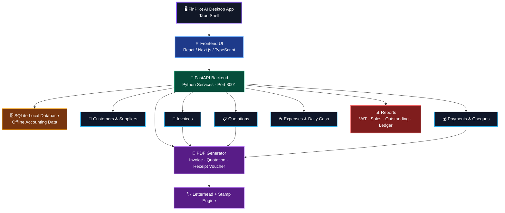

<div align="center">

<p align="center">
  
</p>

# FinPilot AI — Desktop Accounting Software

### FinPilot AI is a modern offline-first desktop accounting and invoicing platform built for UAE workshops, trading companies, and SMEs.

---

[](https://github.com/zohair-azmat-ai)
[](https://github.com/zohair-azmat-ai/FinPilot-AI-Desktop-Accounting-Software)
[]()

[](https://tauri.app)
[](https://fastapi.tiangolo.com)
[](https://sqlite.org)

[]()
[](https://github.com/zohair-azmat-ai)
[]()

</div>

---

## 🚀 Project Overview

**FinPilot AI** is a full-featured, offline-first desktop accounting platform engineered for the real operational needs of UAE workshops, trading firms, and small-to-medium enterprises. It delivers enterprise-grade accounting capabilities — invoicing, quotations, payments, expense tracking, bank management, and compliance reporting — packaged as a fast, portable desktop application with zero cloud dependency.

Built on **Tauri + Next.js + FastAPI + SQLite**, FinPilot AI generates professional-grade PDF documents — tax invoices, UAE-style quotations, receipt vouchers, and account statements — complete with company letterhead, digital stamp, and full UAE VAT 5% compliance baked in.

**Core principles:**

- **Offline-first architecture** — all data stays on your machine, always
- **No monthly cloud subscription** — install once, run forever
- **UAE VAT 5% compliance** — FTA-aligned invoicing and reporting
- **Professional PDF output** — letterhead, company stamp, amount-in-words
- **AI-assisted workflow** — natural language commands, no API key required
- **Desktop-native performance** — fast startup, no browser required
- **Secure local database** — SQLite, encrypted at rest on device

---

## 🏗️ Architecture

The system follows a clean three-tier architecture: the **Tauri desktop shell** hosts a **Next.js frontend** (compiled to static HTML/CSS/JS) that communicates with a **FastAPI backend** (bundled as a portable `.exe` via PyInstaller). The backend persists all data in a **local SQLite database** and drives the **ReportLab PDF engine** on demand.

```
Frontend (Next.js) → REST API (FastAPI) → SQLite → PDF Engine → Reports & Documents
```



---

## ✨ Key Features

| Module | Description |
|--------|-------------|
| **🧾 Tax Invoices** | Auto-numbered UAE tax invoices with VAT 5% per line item, 8-column itemized table, bank details footer, amount-in-words, company letterhead, and optional digital stamp. |
| **📋 Quotations** | Professional UAE workshop-style quotation engine with dynamic filler rows, mandatory company stamp, Authorized Signature area, amount-in-words row, and one-click conversion to invoice. |
| **💳 Payments & Receipts** | Full payment recording against invoices with partial allocation support, advance receipt mode, receipt voucher PDF, and cheque handling. |
| **📜 Cheque Register** | Inward and outward cheque tracking with status lifecycle management: Pending → Cleared → Bounced. |
| **🏦 Bank Management** | Multi-account bank ledger with per-account transaction history, running balance, and downloadable bank statement PDF. |
| **☕ Daily Expenses** | Petty cash tracker with 8 predefined categories — Tea/Coffee, Petrol, Parking, Labour Lunch, Courier, Supplies, Tools, and Other — with date-range filtering. |
| **💸 General Expenses** | Supplier-linked and bank-linked expense management with full CRUD, category breakdown, and date-range reporting. |
| **👥 Customer CRM** | Complete customer management with TRN, opening balance, contact details, and auto-generated accounts receivable ledger. |
| **🚚 Supplier Management** | Supplier directory linked to expense and purchase workflows. |
| **📦 Items & Services** | Reusable price catalog with VAT toggle per item and unit type support (Nos, Kg, m², Service, etc.). |
| **📖 Ledger** | Auto-generated debit/credit ledger with running balance per customer, driven by all invoices and payments. |
| **📊 Reports** | Sales report, Outstanding AR, UAE FTA-aligned VAT summary, and Customer Balance report — all with date-range filters. |
| **🤖 AI Commands** | Natural language accounting commands processed entirely offline — no API key, no internet connection required. |

---

## 📊 Accounting Modules

FinPilot AI covers the complete accounts-receivable cycle:

```
Customer Created → Quotation Issued → Invoice Raised → Payment Received → Ledger Updated → Statement Generated
```

**Supported workflows:**

- Issue a UAE-style quotation and convert it to a tax invoice in one click
- Record full or partial payments against any open invoice
- Track advance payments and allocate them against future invoices
- Manage inward and outward cheques with clearance status tracking
- Record daily petty cash alongside supplier-linked general expenses
- Reconcile bank accounts with a full transaction statement
- Generate VAT-ready reports for FTA submissions

---

## 🧾 PDF Engine

All documents are generated locally using [ReportLab](https://www.reportlab.com/) and saved to `%USERPROFILE%\FinPilot\exports\`. No external service or internet connection is required.

### Tax Invoice
A fully compliant UAE tax invoice with auto-sequential numbering (INV-0001, INV-0002…), an 8-column line-item table showing quantity, unit price, amount, tax rate, tax amount, and line total, plus a bank details block with IBAN and SWIFT. Amount in words is auto-generated (e.g. *One Thousand Fifty Only*). Supports digital letterhead rendered on canvas and an optional company stamp.

### Quotation — UAE Workshop Style
A bordered, professionally laid-out quotation with separate Customer Details and Quotation Details boxes, a dynamic items table that expands with filler rows to fill the page, a full-width Amount in Words row (`TOTAL :-   ONE THOUSAND FIFTY ONLY   *****`), mandatory company stamp, and Authorized Signature. Includes soft professional terms and conditions. Guaranteed single-page output.

### Receipt Voucher
Supports both standard and advance receipt modes. Includes a payment allocation breakdown table, amount-in-words block, company stamp, and dual signature areas.

### Account Statement
Date-range filtered customer statement showing all debit and credit transactions, running balance column, and clearly displayed opening and closing balances.

### Bank Statement
Per-account transaction history exported as a clean PDF with balance summary.

---

## 🤖 AI Features

FinPilot AI includes a built-in natural language command processor that lets users perform common accounting actions by typing plain-English instructions — no API key, no cloud service, no internet required.

The AI parser runs entirely locally as a rule-based NLP engine. It interprets intent from user input and maps it to backend accounting operations in real time.

**Example commands:**

```
"Create invoice for Gulf Extrusion 1000 AED"
"Add payment 500 AED to invoice INV-0001"
"Show ledger for Ahmed LLC"
"Make statement for May"
"Show VAT report"
"Backup database"
```

**Current capabilities:**
- Invoice creation from natural language
- Payment recording against existing invoices
- Ledger and statement lookups by customer name
- Report generation (Sales, VAT, Outstanding)
- Database backup trigger

**Roadmap:**
- Conversational multi-step workflow (e.g. create → approve → send)
- Expense categorization suggestions via ML
- Scheduled auto-reports
- Integration with Claude API for advanced reasoning (optional, opt-in)

---

## 🛠️ Tech Stack

| Layer | Technology | Purpose |
|-------|-----------|---------|
| **Desktop Shell** | Tauri v1 (Rust) | Native OS window, WebView2 renderer, app bundling |
| **Frontend** | Next.js 14 + Tailwind CSS | Dark-theme React UI, App Router, Axios API client |
| **Backend** | FastAPI + Uvicorn (Python) | REST API layer, business logic, PDF generation |
| **Database** | SQLite + SQLAlchemy ORM | Local offline data persistence with relational integrity |
| **PDF Engine** | ReportLab | Programmatic PDF generation for all document types |
| **AI Parser** | Custom NLP rule engine | Offline natural language → accounting action mapping |
| **Packaging** | PyInstaller + Tauri bundler | Portable `.exe` backend + Tauri desktop installer |

---

## 📷 Screenshots

> Place app screenshots in [`docs/screenshots/`](docs/screenshots/) and they will render here automatically.

| Dashboard | Invoice |
|-----------|---------|
|  |  |

| Quotation | Reports |
|-----------|---------|
|  |  |

---

## 📂 Project Structure

```
FinPilot AI/
├── backend/                     # FastAPI Python backend
│   ├── main.py                  # Application entry point + auto-migrations
│   ├── database.py              # SQLAlchemy engine and session factory
│   ├── models.py                # ORM models for all database tables
│   ├── schemas.py               # Pydantic request/response schemas
│   ├── pdf_generator.py         # ReportLab engine — all document types
│   ├── ai_parser.py             # Offline NLP command parser
│   ├── routes/
│   │   ├── invoices.py          # Invoice CRUD + PDF generation
│   │   ├── quotations.py        # Quotation CRUD + convert to invoice + PDF
│   │   ├── payments.py          # Payment recording + receipt voucher PDF
│   │   ├── expenses.py          # General and daily expense management
│   │   ├── bank_accounts.py     # Bank account CRUD and summary
│   │   ├── bank_transactions.py # Transaction ledger + statement PDF
│   │   ├── cheques.py           # Cheque inward/outward register
│   │   ├── customers.py         # Customer CRM
│   │   ├── suppliers.py         # Supplier directory
│   │   ├── ledger.py            # Customer ledger + account statements
│   │   ├── reports.py           # Sales, VAT, outstanding, balance reports
│   │   └── ai_command.py        # AI command routing
│   └── requirements.txt
│
├── frontend/                    # Next.js 14 + Tailwind CSS
│   └── src/
│       ├── app/                 # Next.js App Router pages
│       │   ├── page.tsx         # Main dashboard with KPI cards
│       │   ├── invoices/        # Invoice list and creation
│       │   ├── quotations/      # Quotation builder
│       │   ├── payments/        # Payment recording
│       │   ├── expenses/daily/  # Daily petty cash tracker
│       │   ├── bank/            # Bank accounts, transactions, cheques
│       │   ├── ledger/          # Customer ledger view
│       │   ├── reports/         # Reports and analytics
│       │   └── ai/              # AI command interface
│       ├── components/
│       │   ├── Sidebar.tsx      # Application navigation
│       │   └── Header.tsx       # Page header component
│       └── lib/api.ts           # Centralised Axios API client
│
├── desktop/                     # Tauri desktop wrapper
│   └── src-tauri/
│       ├── src/main.rs          # Tauri application entry point
│       ├── Cargo.toml           # Rust dependency manifest
│       └── tauri.conf.json      # Window configuration and bundle settings
│
├── docs/
│   ├── assets/                  # Logo and branding assets
│   └── screenshots/             # Application screenshots
│
├── setup.bat                    # First-time dependency installer
├── start.bat                    # Launch backend and frontend together
└── README.md
```

---

## ⚡ Installation

### Prerequisites

| Tool | Minimum Version |
|------|----------------|
| Python | 3.10+ |
| Node.js | 18+ |

### Quick Start — Windows

```bat
git clone https://github.com/zohair-azmat-ai/FinPilot-AI-Desktop-Accounting-Software.git
cd FinPilot-AI-Desktop-Accounting-Software

REM Install all dependencies (first time only)
setup.bat

REM Launch the application
start.bat
```

The application opens at **http://localhost:3000** and the FastAPI backend starts automatically on port 8001.

---

## 🔧 Development Setup

### Backend — FastAPI

```bash
cd backend
pip install -r requirements.txt
uvicorn main:app --host 127.0.0.1 --port 8001 --reload
```

Interactive API docs available at: http://127.0.0.1:8001/docs

### Frontend — Next.js

```bash
cd frontend
npm install
npm run dev
```

Development UI at: http://localhost:3000

### Environment Configuration

Override the default API URL by creating `frontend/.env.local`:

```env
NEXT_PUBLIC_API_URL=http://127.0.0.1:8001
```

---

## 🖥️ Build Desktop App

### Step 1 — Bundle the Backend

```bash
cd backend
pyinstaller backend.spec --noconfirm
# Output: backend/dist/backend/backend.exe
```

### Step 2 — Export the Frontend

```bash
cd frontend
npm run build
# Output: frontend/out/ (static HTML/CSS/JS)
```

### Step 3 — Package with Tauri

```bash
# Prerequisite: install Rust from https://rustup.rs
cd src-tauri
cargo tauri build
# Output: src-tauri/target/release/bundle/
```

The final output is a self-contained Windows installer (`.msi` or `.exe`) that bundles the backend, frontend, and Tauri shell into a single distributable package.

---

## 🗺️ Roadmap

- [ ] Multi-company support with separate databases
- [ ] Direct PDF email delivery from within the app
- [ ] Purchase order and goods receipt module
- [ ] Inventory and stock management
- [ ] WhatsApp PDF sharing integration
- [ ] Arabic language UI support
- [ ] Mobile companion app (read-only dashboard)
- [ ] Optional Claude API integration for advanced AI reasoning
- [ ] Auto-scheduled report delivery

---

## 👨‍💻 Author

<div align="center">

**Zohair Azmat**

[](https://github.com/zohair-azmat-ai)

*Built with precision for real UAE workshop operations.*

</div>

---

## 📜 License

<div align="center">

**Copyright © 2026 Zohair Azmat. All Rights Reserved.**

This project is publicly viewable for portfolio and demonstration purposes.

Commercial use, resale, redistribution, or reuse of any part of this codebase
requires explicit written permission from the author.

[]()

</div>
